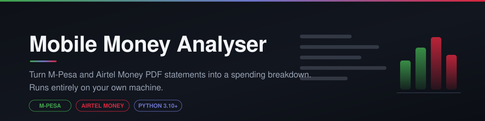
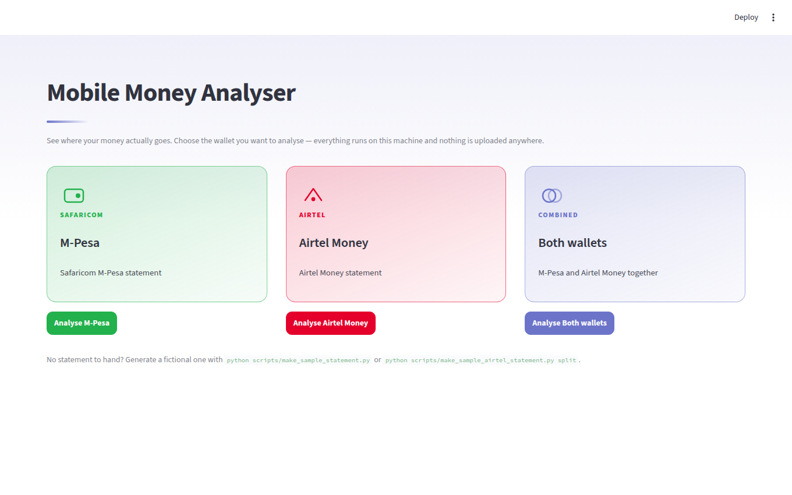
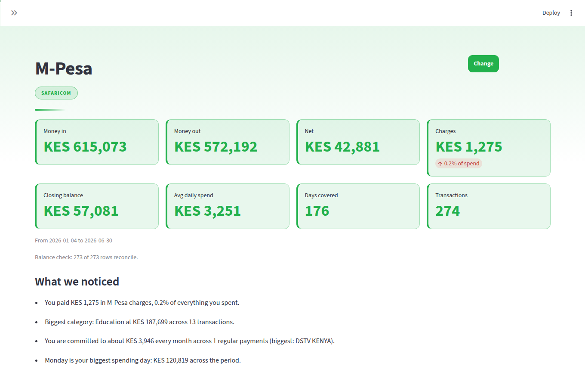
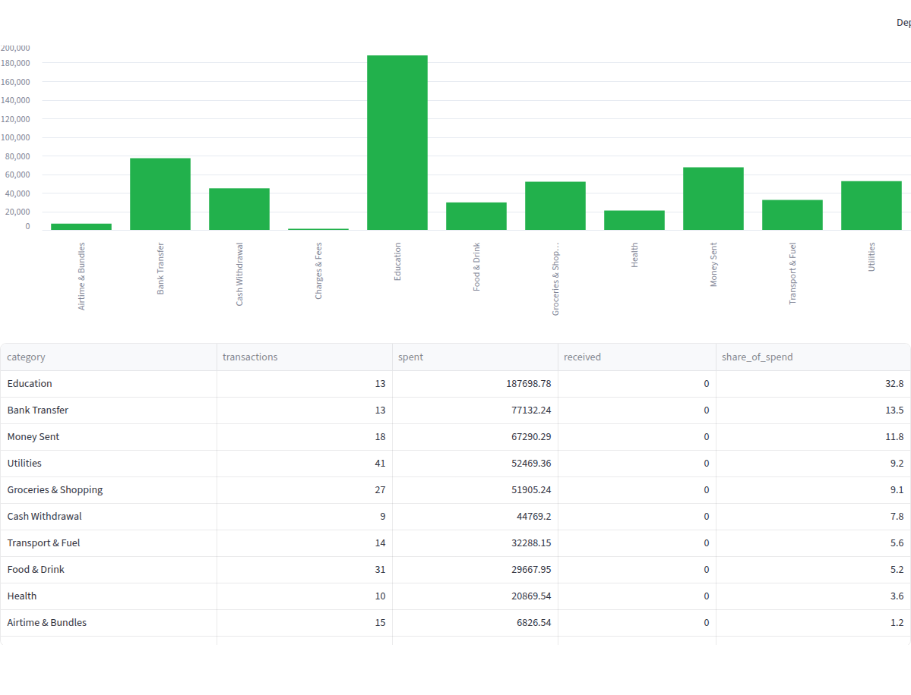

<p align="center">
  
</p>

<h1 align="center">Mobile Money Analyser</h1>

<p align="center">
  <strong>Parse M-Pesa, Airtel Money and T-Kash PDF statements in Python and see where your money actually goes.</strong><br>
  A free, offline statement analyser for Kenya. No uploads, no accounts, no third party.
</p>

<p align="center">
  
  
  
  
  
  
  
</p>

---

## The problem

Safaricom and Airtel both email you a PDF statement every month. Both are a wall
of rows: a receipt number, a timestamp, a description, three amounts. Fine if you
are hunting one transaction. Useless if you want to know where your money goes.

Bank apps categorise your spending. Mobile money does not. **This closes that
gap, without handing your financial data to anyone.**

```
M-Pesa + Airtel Money — mpesa.pdf, airtel.pdf
Transactions    406
Money in        KES 1,471,930.72
Money out       KES   928,627.47
Charges         KES     2,945.50 (0.3% of spend)

By provider
M-Pesa               in KES 748,620.88  out KES 629,533.55  (256 txns)
Airtel Money         in KES 723,309.84  out KES 299,093.92  (150 txns)

Spending by category
Education                KES 299,713.18   32.3%  (22 txns)
Cash Withdrawal          KES 167,397.00   18.0%  (25 txns)
Groceries & Shopping     KES  92,056.23    9.9%  (37 txns)
Cross-network Transfer   KES  42,386.66    4.6%  ( 9 txns)
```

## What it does

- **Reads the PDF** — including password-protected M-Pesa statements
- **Detects the provider** automatically — M-Pesa, Airtel Money or T-Kash —
  and re-analyses CSVs previously exported from this tool
- **Categorises every transaction** into 19 categories tuned for Kenyan
  merchants: KPLC, Nairobi Water, Naivas, Quickmart, Fuliza, M-Shwari, DSTV
- **Extracts the counterparty**, so you see `KPLC PREPAID` rather than
  `Pay Bill Online to 888880 - KPLC PREPAID Acc. 4471029`
- **Tracks what the wallet cost you** — total charges as a share of spending,
  with a dedicated Fuliza / M-Shwari / KCB M-Pesa borrowing breakdown
- **Finds your recurring payments** — rent, school fees, subscriptions, chama —
  and totals your monthly commitment
- **Verifies its own numbers** — every row's running balance is reconciled
  against the amounts, so parsing errors surface instead of hiding
- **Shows the trend** by month, by weekday and by hour, with a forecast
- **Merges both wallets** into one timeline, pairing transfers between your
  own wallets so they are not counted as income *and* spending
- **Learns your merchants** — add your own rules in
  `~/.mobile-money/rules.json` to claim a landlord or local shop out of 'Other'
- **Exports to CSV or JSON**, re-analyses its own CSV exports, and runs as
  either a CLI or a web dashboard

## Quick start

```bash
git clone https://github.com/Ferinmtk/mobile-money-analyser.git
cd mobile-money-analyser
python3 -m venv .venv && source .venv/bin/activate
pip install -r requirements.txt
```

Try it immediately on generated data — no real statement needed:

```bash
python scripts/make_sample_statement.py sample_statement.pdf
python -m mobile_money sample_statement.pdf
```

## Usage

**Command line**

```bash
# one statement
python -m mobile_money mpesa.pdf --password 12345678

# both wallets, as one timeline
python -m mobile_money mpesa.pdf airtel.pdf --csv combined.csv

# force a parser if detection gets it wrong
python -m mobile_money statement.pdf --provider airtel

# machine-readable: the full analysis as one JSON document
python -m mobile_money mpesa.pdf --json | jq '.overview.money_out'

# your own categorisation rules ({"regex": "Category"})
python -m mobile_money mpesa.pdf --rules my-rules.json

# re-analyse a CSV exported earlier — no PDF needed
python -m mobile_money transactions.csv
```

**Web dashboard**

```bash
streamlit run app.py
```

Opens on a provider chooser — M-Pesa, Airtel Money, or both — then themes the
session to match and shows charts, category breakdowns and a filterable
transaction table.

**As a library**

```python
from mobile_money import parse_statement, prepare, overview, by_category

statement = parse_statement("mpesa.pdf", password="12345678")
frame = prepare(statement.transactions)

print(overview(frame)["money_out"])
print(by_category(frame).head())
```

## Screenshots

*Captured against generated sample data. The app shows real provider logos if
you supply them locally (see [Branding](#branding)); these use the built-in
fallback icons so no trademarks are redistributed.*

| Provider chooser | Statement overview |
|---|---|
|  |  |



## How it works

```
statement.pdf
     │
     ▼
 parsers/            detect provider from the first page
     ├── mpesa.py    receipt number + ISO timestamp signature
     ├── airtel.py   header mapping, then word positions
     └── tkash.py    same adaptive path as Airtel
     │
     ▼
 base.normalise()    one schema regardless of provider:
     │               receipt_no, completion_time, details, status,
     │               paid_in, withdrawn, balance, provider
     ▼
 categories.py       ordered regex rules → category + counterparty
     │
     ▼
 analysis.py         overview, by category, by month, by provider,
     │               top counterparties, forecast, insights
     ▼
 cli.py / app.py
```

Everything downstream of `normalise()` is provider-agnostic, so adding a
provider means writing a parser and nothing else changes.

<details>
<summary><strong>Four problems worth explaining</strong></summary>

<br>

**Detecting M-Pesa by keyword does not work.** Airtel narrations say things like
`Send Money to Other Network MPESA 254712...`, so searching for the word sends
Airtel statements to the wrong parser. Detection is structural instead: a
10-character receipt followed by an ISO timestamp is a shape only M-Pesa
produces. Airtel is the reverse — its brand *is* the signal, so it is only
trusted in the statement header, never in the body.

**Airtel prints two different layouts.** Some exports have separate Paid In and
Withdrawn columns; others have a single signed Amount column. A negative amount
is unambiguous, an unsigned one is not, so direction is read from the
description (`Money Received`, `Cash In`, `Deposit` mean inflow). A test asserts
both layouts produce identical totals from identical data, which is what would
break first if that inference regressed.

**Not every statement has a ruled table.** Without ruling lines `pdfplumber`
returns loose text, and a lone `4,500.00` on a line is ambiguous. The fallback
reads the x-coordinate of every word and assigns it to the column whose header
it sits under. Position is the only thing that disambiguates.

**Rule order matters.** `Customer Transfer Charge` contains both "transfer" and
"charge". Charges are checked first, which keeps a KES 23 fee out of the
money-sent total and off every percentage on the page.

</details>

## Privacy

Statements are financial records, so the design assumes they should never leave
the machine they are read on.

- Everything runs locally. **No network calls, no external API, no telemetry.**
- The dashboard parses uploads entirely in memory — they are never written
  to disk, not even as a temporary file.
- Phone numbers are masked to the last four digits.
- `.gitignore` blocks `*.pdf` and `*.csv`, so a real statement cannot be
  committed by accident.
- Tests and demos run on generated data, never a real statement.

## Branding

The dashboard can display provider logos if you place them in `assets/`:

```
assets/mpesa.png    assets/airtel.png    assets/both.png
```

If they are absent the app falls back to its own icons, so nothing breaks.
`assets/*` is gitignored on purpose — Safaricom, M-Pesa and Airtel logos are
registered trademarks, and redistributing them implies an endorsement that does
not exist. A commercial release would need written permission from each
operator.

## Tests

```bash
pytest
```

The suite covers provider detection, both Airtel layouts, merging, direction
inference, money-string edge cases (`(500.00)`, `250.00 DR`, `KES 3,400.50`),
date formats, category rule ordering, balance reconciliation and every
analysis function. All tests run against generated statements, so no real
financial data is involved. CI runs them on every push across Python
3.10–3.13.

## FAQ

### How do I get my M-Pesa statement as a PDF?

Dial `*334#` and choose My Account → M-Pesa Statement, or request one in the
M-PESA app. Safaricom emails it as a password-protected PDF.

### What is the password on an M-Pesa statement?

Usually the ID number the line is registered to. Pass it with `--password`.

### Does this work with Kenyan bank statements?

Not this project. It is deliberately scoped to mobile money. Bank statements
have a different shape and a different audience.

### Is my data sent anywhere?

No. There are no network calls anywhere in the codebase. Everything is parsed
and analysed locally.

### It says no transactions were found

Airtel exports vary. The usual fix is a column name the mapper does not know
yet — add it to `HEADER_ALIASES` in `src/mobile_money/parsers/base.py`. Open an
issue with the column headers and it can be added upstream.

### Can I add another provider?

Yes. Write a parser exposing `detect(text)` and `parse(path, password)` that
returns a `Statement`, register it in `parsers/__init__.py`, and the entire
analysis layer works unchanged. T-Kash was added exactly this way — for a
statement with recognisable column headers, `base.header_mapped_parse` does
the whole job and the parser is ~40 lines.

## Roadmap

- [x] T-Kash support
- [x] Recurring payment detection
- [x] Fuliza / loans cost breakdown
- [x] Balance-chain reconciliation
- [x] User-defined categorisation rules
- [ ] Validate the Airtel and T-Kash parsers against real exports
- [ ] Budget targets per category
- [ ] Hosted demo

## Contributing

Issues and pull requests are welcome, particularly real-world statement layouts
that fail to parse. **Never attach a real statement to an issue** — describe the
column headers or share a redacted sample instead.

## Licence

MIT — see [LICENSE](LICENSE).

---

<sub>
Not affiliated with, endorsed by, or connected to Safaricom PLC or Airtel
Networks Kenya. M-PESA is a trademark of Vodafone Group; Airtel Money is a
trademark of Airtel. This is an independent open source tool.
</sub>

<sub>
<strong>Keywords:</strong> M-Pesa statement parser · M-Pesa PDF to CSV · Airtel
Money statement analyser · parse M-Pesa statement Python · Safaricom statement
PDF password · Kenya personal finance tracker · mobile money spending analysis ·
pdfplumber M-Pesa · M-Pesa transaction categorisation · Airtel Money PDF parser ·
T-Kash statement parser · Fuliza charges tracker · recurring payments Kenya ·
Kenyan fintech open source · M-Pesa charges calculator
</sub>
